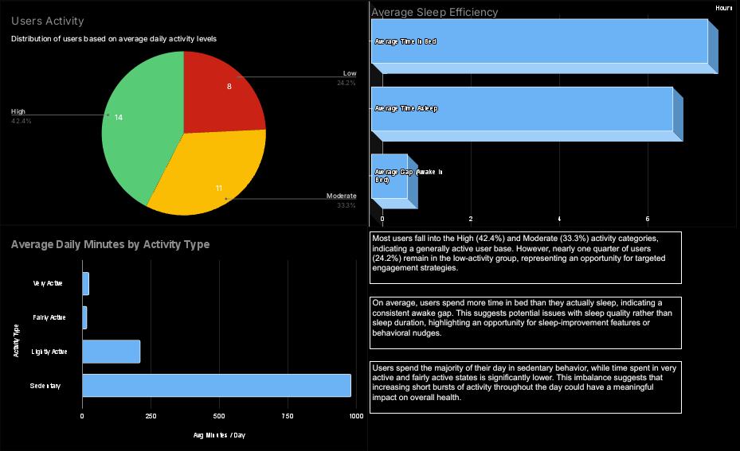

# 📊 Project Title
> Short one-line description of the project (business or analytical focus)

---

## 📌 Objective
Describe the problem you wanted to solve and **why it matters**.

---

## 📊 Dataset
- **Source:**  
- **Description:**  
- **Number of records:**  
- **Key features:**  

---

## 🛠 Tools & Technologies
- Power BI / Tableau / Excel  
- SQL / R / Python (only what you used)  

---

## 🔍 Analysis Process
1. Data understanding & cleaning  
2. Data transformation  
3. Exploratory data analysis (EDA)  
4. Dashboard / visualization creation  
5. Insight extraction  

---

## 📈 Key Insights
- Insight 1  
- Insight 2  
- Insight 3  

---

## 📊 Dashboard Preview
*(Screenshots will be added here)*

```md

