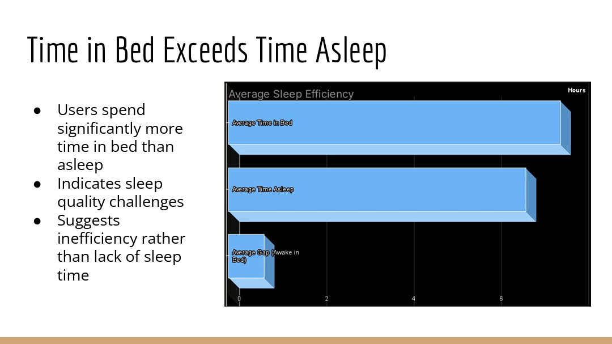
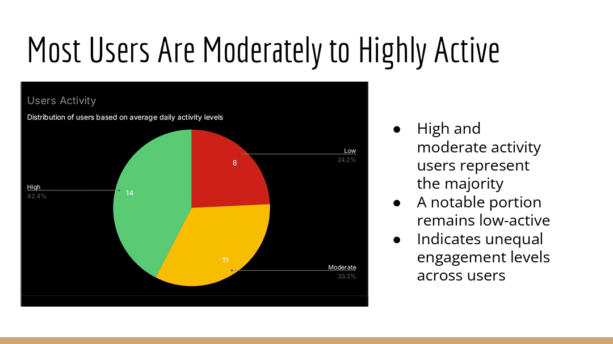

# 📊 Bellabeat Smart Device Usage Analysis  
*Junior Data Analyst Case Study*

## 📈 Dashboard Preview

---

## 📌 Business Objective
Bellabeat aims to understand how consumers use smart fitness devices in order to identify opportunities to improve engagement and refine marketing strategies.  
This analysis focuses on uncovering **activity, sleep, and usage behavior trends** from non-Bellabeat smart device data and applying those insights to **Bellabeat’s app and Leaf device**.

---

## 🔍 Key Insights
*(High-level, business-focused insights)*

### 1️⃣ Most users lead low-intensity lifestyles
- Average daily behavior is dominated by **sedentary and light activity**
- Moderate and high-intensity activity is rare  
**Implication:** Bellabeat marketing should emphasize *small, achievable activity goals* rather than high-performance fitness.

### 2️⃣ Sleep efficiency varies despite similar time in bed
- Most users spend **more time in bed than actually sleeping**
- Small gaps indicate good sleep hygiene for many users, while others show inefficiencies  
**Implication:** Bellabeat can promote sleep-quality insights and bedtime consistency features inside the app.

> 📌 *Additional insights from charts are detailed in the Analysis section below.*

---

## 🛠 Technical Summary

| Aspect | Details |
|------|--------|
| Tools Used | Google Sheets, Microsoft Excel |
| Data Source | Fitbit Fitness Tracker Data (Kaggle – CC0) |
| Datasets Used | dailyActivity_merged, dailySteps_merged, sleepDay_merged |
| Techniques | Data cleaning, aggregation, conditional logic |
| Visuals | Bar charts, summary tables, KPI-style metrics |
| Purpose | Identify behavioral trends to guide Bellabeat marketing strategy |

---

## 🧹 Data Preparation & Cleaning
To ensure consistency and relevance, only **daily-level datasets** were selected from the original 18 CSV files.

**Key actions taken:**
- Removed duplicate user-date records
- Standardized numeric precision across activity distance columns
- Converted sleep minutes into hours for interpretability
- Removed redundant time components from sleep date fields
- Retained only columns relevant to steps, sleep, and activity behavior

**Why only 3 datasets?**  
They provided the most complete and comparable view of user behavior while minimizing inconsistencies caused by mismatched time granularities.

---

## 🔧 Functions & Techniques Used
*(Mentioned lightly, as requested)*

- `UNIQUE()` → identify distinct user IDs
- `AVERAGEIF()` → calculate average daily steps and activity metrics
- `COUNTIF()` → support activity level categorization
- Conditional formatting → highlight activity thresholds
- Unit conversion (minutes → hours) → improve sleep analysis clarity
- Basic arithmetic operations → gap calculation (time in bed vs sleep)

---

## 📊 Analysis Breakdown

### 🏃 Activity & Steps Analysis

- Users were grouped into **Low (<5,000)**, **Moderate (5,000–8,000)**, and **High (>8,000)** activity levels
- Most users fall into the **moderate category**, with fewer highly active users

---

### 😴 Sleep Behavior Analysis

- Average sleep duration is ~7 hours
- Time in bed often exceeds actual sleep time
- Sleep efficiency varies significantly between users

---

### 🪑 Daily Activity Intensity

- Sedentary time dominates daily routines
- Light activity is common
- Fairly active and very active minutes are minimal

---

## 🎯 Marketing Recommendations
- Promote **light activity challenges** to match user behavior
- Highlight **sleep insights and consistency tracking**
- Use positive reinforcement rather than performance-driven messaging
- Encourage gradual habit formation via app notifications

---

## 📁 Files Included
- 📄 `README.md` – Project documentation
- 📊 `Bellabeat_Analysis.xlsx` – Cleaned datasets & calculations
- 🖼 Charts & dashboards (see `/images`)
- 🎤 Presentation slides (PDF)

---

## 📬 Contact
**Loucif Mohamed Nidal**  
Junior Data Analyst  

- 📧 Email: mednidalloucif@gmail.com  
- 💻 GitHub: https://github.com/LoucifNidal  
- 📊 Kaggle: https://www.kaggle.com/nidalloucif  

